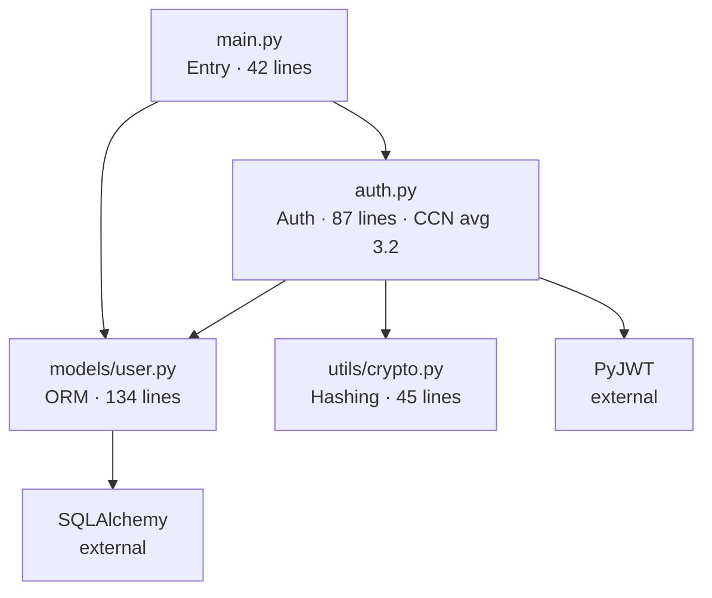
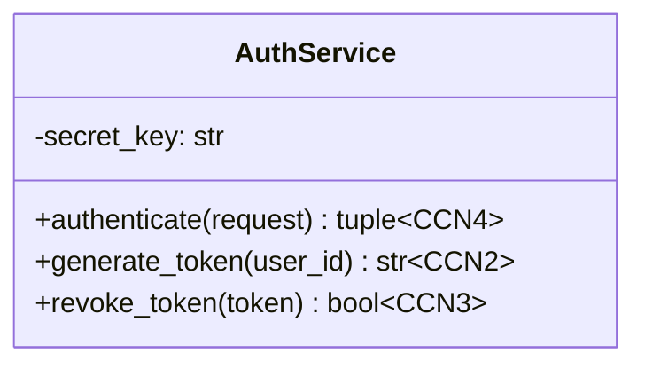
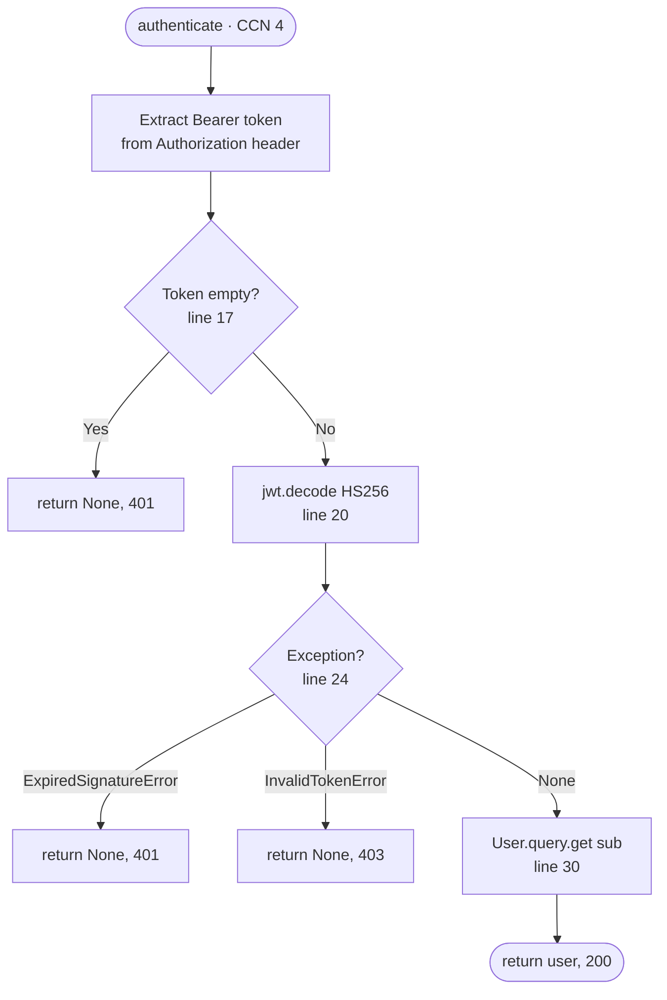

# Source Mapper Skill — Tool-Augmented Deep Mode

Produce a **complete, multi-format source map** of any code in any language.
Strategy: **run real tools first to get hard data, then layer Claude's understanding on top.**

Output: Markdown doc + Mermaid diagrams + JSON source map + line annotations + deep code review.

---

## Step 0: Detect Environment & Install Tools

When bash tools are available, try to install and run real analysis tools first.
This gives you **real metrics** (actual complexity scores, real line counts, actual warnings)
instead of estimates.

```bash
# Check Python available
python3 --version

# Install analysis tools (fast, lightweight)
pip install lizard --break-system-packages -q        # complexity + function list, 20 languages
pip install tree-sitter tree-sitter-language-pack --break-system-packages -q  # AST parsing
# Note: semgrep is large (~50MB), only install if user explicitly wants security scan
```

If pip/bash is not available: skip to Step 2 and do full Claude-only analysis. Note this at top of output.

---

## Step 1: Run Real Tools on the Code

Save the user's code to a temp file first:

```bash
# Save code to temp file for tool analysis
cat > /tmp/source_map_input.<ext> << 'EOF'
<paste code here>
EOF
```

### Tool 1: Lizard — Function Complexity & Metrics

Lizard supports: cpp, java, csharp, javascript, python, objectivec, ruby, php, swift, scala, go, lua, rust, typescript, plsql and more.

```bash
# Run lizard — gives real function list with complexity scores and line counts
lizard /tmp/source_map_input.<ext> --csv 2>/dev/null
# Or for verbose output with full function names:
lizard /tmp/source_map_input.<ext> -V 2>/dev/null
```

Lizard output gives you for each function:
- `nloc` — non-comment lines of code
- `CCN` — cyclomatic complexity number (branches + 1)
- `token_count` — size proxy
- `parameter_count` — argument count
- `start_line`, `end_line` — exact location

**CCN thresholds for review flags:**
| CCN | Meaning | Flag |
|-----|---------|------|
| 1–5 | Simple, easy to test | ✅ |
| 6–10 | Moderate complexity | 🟢 note |
| 11–15 | High — consider refactor | 🟡 warn |
| 16+ | Very high — refactor needed | 🔴 critical |

### Tool 2: tree-sitter — AST Parsing (Deep Structure)

Tree-sitter generates parsers based on a language and provides insights about the code as seen by the engine. It takes that messy code and weaves it into a clear, structured map — an Abstract Syntax Tree (AST) — revealing the relationships between different parts.

```python
# Quick tree-sitter analysis script
from tree_sitter_language_pack import get_parser
import json, sys

lang = sys.argv[1]  # e.g. "python", "javascript", "typescript", "rust", "go"
code = open(sys.argv[2], "rb").read()

parser = get_parser(lang)
tree = parser.parse(code)

def extract_nodes(node, source, depth=0):
    results = []
    if node.type in ("function_definition", "function_declaration",
                     "method_definition", "class_definition", "class_declaration",
                     "import_statement", "import_declaration"):
        name_node = node.child_by_field_name("name")
        name = source[name_node.start_byte:name_node.end_byte].decode() if name_node else "?"
        results.append({
            "type": node.type,
            "name": name,
            "start_line": node.start_point[0] + 1,
            "end_line": node.end_point[0] + 1,
        })
    for child in node.children:
        results.extend(extract_nodes(child, source, depth + 1))
    return results

nodes = extract_nodes(tree.root_node, code)
print(json.dumps(nodes, indent=2))
```

Run as: `python3 /tmp/ts_analyze.py python /tmp/source_map_input.py`

The tree-sitter-language-pack bundles a comprehensive collection of tree-sitter languages as pre-built wheels. Supported: python, javascript, typescript, rust, go, java, kotlin, ruby, php, c, cpp, c_sharp, swift, bash, sql, and many more.

### Tool 3: Semgrep — Security & Pattern Issues (Optional, Large Install)

Only install if user asks for security review or if `semgrep` is already available:

```bash
# Check if already installed
which semgrep && semgrep --version

# If available, run security scan with auto rules
semgrep scan --config=auto /tmp/source_map_input.<ext> --json 2>/dev/null
```

Semgrep is a fast, open-source, static analysis tool that searches code, finds bugs, and enforces secure guardrails. It supports 30+ languages and can run in an IDE, as a pre-commit check, and as part of CI/CD workflows.

Semgrep JSON output gives you:
- `check_id` — rule name (e.g. `python.lang.security.audit.sqli`)
- `path`, `start.line`, `end.line` — exact location
- `message` — what the issue is
- `severity` — ERROR / WARNING / INFO

### Fallback: Pure Claude Analysis

If tools fail or are unavailable:
- Manually scan for function/class definitions using language-specific patterns
- Estimate complexity by counting `if/else/for/while/switch/catch/case` branches
- Note at top of output: `⚠️ Tool analysis unavailable — using Claude static analysis`

---

## Step 2: Detect Input Type

| Input | Action |
|-------|--------|
| Code pasted in chat | Save to `/tmp/` and analyze |
| Uploaded file | Read from `/mnt/user-data/uploads/` |
| Directory / zip | `unzip` → `find . -type f` → analyze each file |
| GitHub URL | `web_fetch` raw URL → save to `/tmp/` |
| Snippet / function | Full analysis still applies |

---

## Step 3: Build the Five-Format Output

Use **real tool data** wherever available. Mark estimates with `~` when using Claude-only analysis.

---

### FORMAT 1 — Markdown Document

#### 1.1 Header Block

```
# Source Map: `<filename>`

| Field | Value |
|-------|-------|
| Language | ... |
| Total Lines | N (from lizard or wc -l) |
| Functions | N (from lizard/tree-sitter) |
| Classes | N (from tree-sitter) |
| Avg Complexity | N.N CCN (from lizard) |
| Highest Complexity | functionName() — CCN N (from lizard) |
| External Deps | lib1, lib2 (from imports) |
| Entry Point | main() / index.js / etc. |
| Analysis Tools Used | lizard ✓, tree-sitter ✓, semgrep ✓/✗ |
| Purpose | One sentence plain English summary |
```

#### 1.2 Architecture Overview

4–6 sentences: problem solved, structure style, main components, external dependencies, design patterns.

#### 1.3 File & Module Map

```
project/
├── auth.py          — JWT auth middleware, token generation (87 lines, avg CCN 3.2)
├── models/user.py   — User ORM model and queries (134 lines, avg CCN 2.1)
└── utils/crypto.py  — Password hashing helpers (45 lines, avg CCN 1.8)
```

Include real line counts and complexity from lizard output.

#### 1.4 Line-by-Line Annotations

For each major block, show actual code with inline explanation comments:

```python
# BLOCK: authenticate() — lines 12–34 | CCN: 4 | params: 1 | nloc: 18
def authenticate(request):        # Entry point — receives raw HTTP Request
    token = request.headers       # Pull Authorization header dict
        .get("Authorization", "") # Default "" prevents KeyError on missing header
        .replace("Bearer ", "")   # Strip "Bearer " prefix — token is what follows

    if not token:                 # Branch 1 of 4 (CCN contribution)
        return None, 401          # Fail-fast: no token = unauthorized

    try:
        payload = jwt.decode(     # Decode AND verify signature atomically
            token,
            SECRET_KEY,
            algorithms=["HS256"]  # ← Explicit whitelist prevents alg:none attack
        )
    except jwt.ExpiredSignatureError:   # Branch 2 (CCN)
        return None, 401
    except jwt.InvalidTokenError:       # Branch 3 (CCN)
        return None, 403

    user = User.query.get(payload["sub"])  # "sub" = JWT standard user ID claim
    return user, 200                        # Branch 4 implicit (success path)
```

#### 1.5 Key Logic Explanations

Number each non-obvious logic point. Always cite exact lines.

#### 1.6 Glossary

Terms, acronyms, non-obvious variable names from the actual code.

---

### FORMAT 2 — Mermaid Diagrams (All Three)

#### 2.1 Dependency / Architecture



Include real line counts from tools in node labels.

#### 2.2 Data Flow / Sequence

Trace actual data path through the code — use real function names from tree-sitter output.

#### 2.3 Class / Function Relationships

Use actual class names, method signatures from tree-sitter. Include CCN score per method from lizard.



---

### FORMAT 3 — JSON Source Map

Build this from real tool output:

```json
{
  "source_map": {
    "file": "auth.py",
    "language": "Python",
    "analysis_tools": ["lizard", "tree-sitter"],
    "metrics": {
      "total_lines": 187,
      "code_lines": 134,
      "comment_lines": 28,
      "blank_lines": 25,
      "avg_complexity": 3.4,
      "max_complexity": 8
    },
    "functions": [
      {
        "name": "authenticate",
        "lines": "12-34",
        "nloc": 18,
        "ccn": 4,
        "token_count": 89,
        "parameter_count": 1,
        "signature": "authenticate(request: Request) -> tuple",
        "calls": ["jwt.decode", "User.query.get"],
        "called_by": ["auth_middleware"],
        "raises": ["jwt.ExpiredSignatureError", "jwt.InvalidTokenError"],
        "review_flags": [
          { "severity": "minor", "line": 18, "note": "No logging on auth failure" }
        ]
      }
    ],
    "classes": [...],
    "imports": [...],
    "constants": [...],
    "semgrep_findings": [
      {
        "rule": "python.lang.security.audit.sqli",
        "line": 42,
        "severity": "ERROR",
        "message": "Potential SQL injection via string formatting"
      }
    ],
    "review_summary": {
      "critical": 1,
      "medium": 2,
      "minor": 3,
      "high_complexity_functions": ["process_request (CCN 17)", "parse_token (CCN 12)"],
      "strengths": [],
      "top_issues": []
    }
  }
}
```

---

### FORMAT 4 — Function Flowcharts

One `flowchart TD` per function with CCN > 3. For simple functions (CCN ≤ 2), write `trivial — no flowchart needed`.



---

### FORMAT 5 — Code Review (Deep, Line-Level)

#### ✅ Strengths
Cite real lines. "Line 22: explicit `algorithms=["HS256"]` — prevents alg:none JWT attack."

#### 🔴 Critical — from Semgrep + manual review

| Line | Issue | Tool | Fix |
|------|-------|------|-----|
| 42 | SQL injection — f-string in query | semgrep | Parameterized query |

#### 🟡 Medium — from Lizard CCN + manual review

| Line | Issue | Source | Fix |
|------|-------|--------|-----|
| 78–140 | `process_request()` CCN=17 — too many branches | lizard | Split into smaller functions |
| 18 | Auth failures not logged | manual | Add `logger.warning(...)` |

#### 🟢 Minor

| Line | Issue | Fix |
|------|-------|-----|
| 9 | Magic number `3600` | Add `# 1 hour in seconds` |

#### 💡 Refactor Suggestions — Always With Before/After Code

Show actual code from the file. Before → After. Never just a description.

---

## Step 4: Output Assembly Order

1. Header Block with real metrics
2. Architecture Overview
3. File / Module Map (with real line counts)
4. Dependency Diagram — Mermaid
5. Data Flow Diagram — Mermaid
6. Class / Function Relationship Diagram — Mermaid (with CCN labels)
7. Function Flowcharts — one per function with CCN > 3
8. Line-by-Line Annotations (real code from file)
9. Key Logic Explanations (numbered, with line refs)
10. JSON Source Map (from tool data)
11. Code Review (semgrep findings + lizard high-CCN flags + manual)
12. Glossary
13. Follow-up offer

---

## Step 5: Always End With

> **Source map complete.** Tools used: `<list>`. Want me to:
> - 🔍 Trace a specific function end-to-end?
> - 🧪 Write unit tests for any function?
> - ♻️ Refactor the highest-complexity functions?
> - 🔒 Run a full Semgrep security scan? (requires ~50MB install)
> - 📝 Export this as a downloadable `.md` file?

---

## Step 6: Hard Rules

- **Real tool data takes priority** over Claude estimates — never fabricate metrics
- **JSON always produced** — even for 10-line snippets
- **Every function with CCN > 3 gets a flowchart**
- **Before/after code in every refactor suggestion** — no description-only suggestions
- **Exact line numbers** in every issue — never vague
- **Never hallucinate** — only describe what is in the actual code
- **Mark estimates** with `~` when tools unavailable

---

## Language-Specific Notes

Read `references/language-hints.md` for:
- Language-specific issue patterns (Go goroutine leaks, Rust lifetimes, JS hoisting)
- Which tree-sitter language key to use per extension
- Semgrep ruleset recommendations per language
